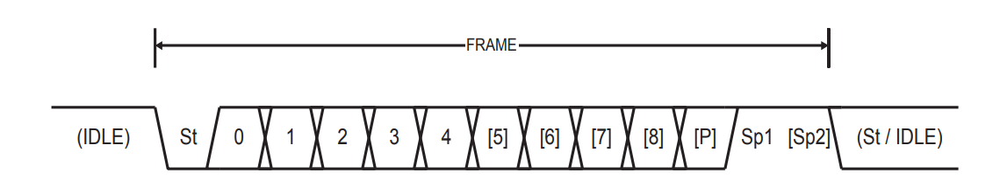

# USART & RS-232 Serial Interfaces

The Universal Synchronous Asynchronous Receiver Transceiver (USART) is a flexible serial communication interface.

Data can be transmitted synchronously with Takt(XCK) or asynchronously without it. In asynchronous mode, clock recovery takes place by means of edge detection and oversampling. 

The USART interface from ATMega implements a superset of functionalitites from RS-232 interface.

## RS-232
RS-232 is still used on a lot of modern peripherals and also a importar debug interface.

High level: Negative voltage (-3V. . . -15V, usually -12 V)
Low level: Positive voltage (+3V. . . +15V, usually +12 V)

### RS-232 Frame

* 1 Start-Bit (St) to synchronize
* 5...9 Data-Bits(0...8)
* A optional Parity bit (P)
* 1...2 Stop bits (Sp) to synchronize
* Optional: Flow Control
    * Additional hardware support for handshaking (flow control) to synchronize transmitter and receiver.

    * Rarely used today because transmitter/receiver is usually fast enough.
* IDLE voltage: High

### Clock Recovery
How does the receiver know when a data bit is valid?

* Data is scanned using AVR 16x (U2Xn=0) and 8x (U2Xn = 1)
* As soon as Data changes from high voltage to low voltage data is sampled.
* Majority decision for samples 8,9,10 or 4,5,6 determines the value of the data bit 

### Baudrate accuracy
Cycle generators from sender and receiver have to be synchronized.

The Highest/Lowest data rate can be defined with:
* BAUDRATE_min = R_slow*BAUDRATE_nom 
* BAUDRATE_max = R_fast*BAUDRATE_nom
* RSLOW = (D+1)S / DS + S - 1 + S_F
* RFAST = (D+2)S / DS + S + SM
* D -> Data width (5...9)
* S -> Sample rate (S = 16 on U2X_n=0 and S = 8 on U2X_n = 1)
* SF, SM: First/Middle Sample for majority decision
(SF = 8, SF = 9 on U2X_n = 0), (SF = 4, SM = 5 on U2X_n = 1)

## USART Data registers
USART I/O data is on register n UDRn. These register is 8 bits long.

* With write access and the transceiver switched on, the byte is sent
* With receiver switched on, the received byte will be written in UDR_n

### USART Control and Status Register UCSRnA
| Bit | 7 | 6 | 5 | 4 | 3 | 2 | 1 | 0 |
|---|---|---|---|---|---|---|---|---|
| Name | RXCn | TXCn | UDREn | FEn | DORn | UPEn | U2Xn | MPCMn |
| Dir | R | R/W | R | R | R | R | R/W | R/W |
| Reset | 0 | 0 | 1 | 0 | 0 | 0 | 0 | 0 |

* RXCn / TXCn: USART Receive / Transmit Completed
* UDREn: USART Data Registry Empty
* FEn: Frame error
* DORn: Data OverRun
* UPEn: USART Pariy Error
* U2Xn: Double the USART Transmission Speed
* MPCMn: Multi-processor Communication Mode

### USART Control and Status Register UCSRnB
| Bit | 7 | 6 | 5 | 4 | 3 | 2 | 1 | 0 |
|---|---|---|---|---|---|---|---|---|
| Name | RXCIEn | TXCIEn | UDRIEn | RXENn | TXENn | UCSZn2 | RXB8n | TXB8n |
| Dir | R/W | R/W | R/W | R/W | R/W | R/W | R | R/W |
| Reset | 0 | 0 | 0 | 0 | 0 | 0 | 0 | 0 |

* RXCIEn / TXCIEn: RX/TX Complete interrupt enable
* UDRIEn: USART Data Registry Empty interrupt
* RXENn / TXENn: Receiver / Transmiter Enable
* UCSZn2: Character size
* RXB8n: Receive Data Bit 8
* TXB8n: Receive Data Bit 8

### USART Control and Status Register UCSRnC
| Bit | 7 | 6 | 5 | 4 | 3 | 2 | 1 | 0 |
|---|---|---|---|---|---|---|---|---|
| Name | UMSELn[1:0] |  | UPMn[1:0] | | USBSn | UCSZn[1:0] |  | UCPOLn |
| Dir | R/W | R/W | R/W | R/W | R/W | R/W | R/W | R/W |
| Reset | 0 | 0 | 0 | 0 | 0 | 1 | 1 | 0 |

* UMSELn[1:0]: USART Mode Select, 0: async, 1: sync, 3: master SPI
* UPM[1:0]: Parity mode, 0: no, 2: par parity, 3: even parity
* USBSn: Stop Bit Select, 0: 1 Stop bit, 1: 2 Stop bit
* UCSZn[1:0]: Character size(5...9), 3: 8 bit
* UCPOLn: Clock Polarity, takt edge detection in synchronous mode

### USART Baud Rate registers UBRRnnL and UBRRnnH
| Bit | 7 | 6 | 5 | 4 | 3 | 2 | 1 | 0 |
|---|---|---|---|---|---|---|---|---|
| Name | - | - | - | - | UBRR[11:8] |  |  |  |
| Dir | R | R | R | R | R/W | R/W | R/W | R/W |
| Reset | 0 | 0 | 0 | 0 | 0 | 0 | 0 | 0 |
---
| Bit | 7 | 6 | 5 | 4 | 3 | 2 | 1 | 0 |
|---|---|---|---|---|---|---|---|---|
| Name | UBRR[7:0] |  |  |  |  |  |  |  |
| Dir | R/W | R/W | R/W | R/W | R/W | R/W | R/W | R/W |
| Reset | 0 | 0 | 0 | 0 | 0 | 0 | 0 | 0 |

BAUDRATE = 2^U2Xn*f_osc / 16(UBRR + 1)

Common baud rates of 75, 300, 1200, 2400, 4800, 9600,
19200, 38400, 57600, and 115200 bit/s can be accurately derived from from a clock with 1, 843200 MHz (or multiples thereof).

With "smooth" oscillator frequencies like e.g. 16.000 MHz these baud rates are only approximately achievable

For Example:
* 1200 Baud with f_osc = 16MHz, U2Xn=0 and UBRR = 832 delivers 1203,37 Baud
* 115200 Baud with f_osc = 16MHz, U2Xn=0 and UBRR = 8 delivers 124513,62 Baud
* 115200 Baud with f_osc = 16MHz ist not achievable

## USART use on ATMega
* Initialize:
    * Set Baudrate over UBRR0L and UBBR0H 
    * Switch on Transmiter or Receiver in UCSR0B
    * Configure Transfer over UCSR0C
* Send:
    * Wait until register UDRE0 in UCSR0A is empty
    * Write Data in UDR0
* Receive
    * Wait until data is receive on RXC0 in UCSR0A
    * Read data on UDR0